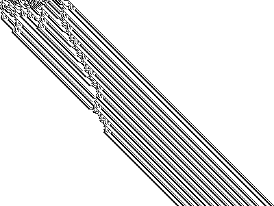
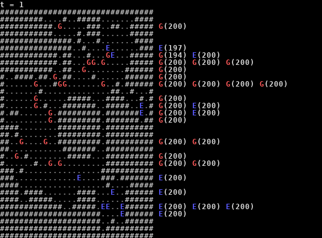
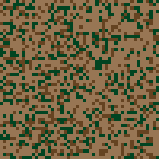

# Advent of Code 2018 in pictures

Apparently [ranked 164th](https://www.reddit.com/r/adventofcode/comments/a9dh93/2018_complete_global_leaderboard/) (357 points, see also [this](../scripts/full_leaderboard_2018)) while competing only a few days for the fun of it.

GIF frames generated using Python Imaging Library (PIL), animated using ImageMagick's `convert`, optimized with `gifsicle -O3`.

## Day 6

## Day 10

## Day 12

## Day 13

## Day 15

## Day 17

## Day 18

## Day 20

## Day 22

