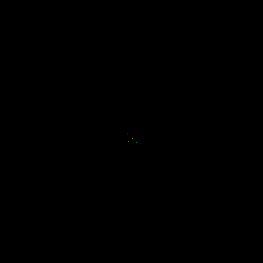
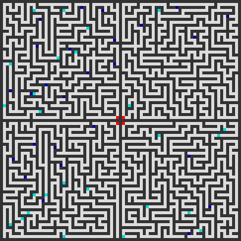

# Advent of Code 2019 in pictures

Unofficially ranked [111th](https://betaveros.github.io/extra-aoc-stats/) (677 points, see also [this](../scripts/full_leaderboard_2019)) while not competing the first 8 days.

GIF frames generated using Python Imaging Library (PIL), animated and optimized with `gifsicle`.

## Day 10

## Day 11

## Day 12

## Day 13

## Day 15

## Day 18

## Day 20

## Day 24
Every two steps (otherwise it blinks a lot) of the cellular automaton on a 100×100 torus:

